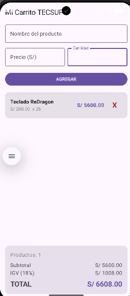

# Laboratorio 04: Mi Carrito TECSUP con LazyColumn

**Estudiante:** Jesús José Castillo Sumire  
**Curso:** Programación en Móviles  
**Docente:** Juan José León Suiyon  
**Institución:** Tecsup

---

## 1. Descripción del Proyecto
Aplicación móvil construida en Android con Jetpack Compose para gestionar un carrito de compras interactivo. Modela datos con una data class en Kotlin, captura productos mediante formularios reactivos, los presenta usando LazyColumn con opción de eliminar ítems en tiempo real, y actualiza de forma automática el panel inferior con Subtotal, IGV (18%) y Total.

---

## 2. Capturas de Pantalla
### Carrito con Productos

* **Estado Vacío:** Caja centrada con mensaje cuando no hay productos y montos en S/ 0.00.
* **Carrito con Productos:** Lista con tarjetas, botón de eliminar y totales calculados.

---

## 3. Respuestas a Preguntas Conceptuales

### (a) ¿Por qué `mutableStateListOf` y no una `MutableList` normal?
`mutableStateListOf` es una colección observable integrada en el sistema de estado de Jetpack Compose. Cada vez que se añade o remueve un elemento, Compose detecta la mutación y redibuja (recompone) de forma automática los componentes que dependen de ella (la lista y los cálculos). Una `MutableList` estándar de Kotlin no emite ninguna señal de cambio, por lo que la interfaz gráfica no se actualizaría.

### (b) ¿Por qué la lista se declara con `val` y aún así podemos agregarle elementos?
`val` garantiza que la referencia de la variable no apunte a otro objeto en memoria (la variable no puede ser reasignada). Sin embargo, el objeto al que apunta es un contenedor mutable internamente, permitiendo modificar sus elementos internos mediante `.add()` o `.remove()` sin alterar la referencia original.

### (c) ¿Qué hace `weight(1f)` en la LazyColumn?
Dentro de un layout `Column`, `weight(1f)` indica que la `LazyColumn` debe expandirse para ocupar todo el espacio vertical disponible sobrante. Esto permite que la lista tenga scroll independiente mientras empuja y fija el panel de totales en la parte inferior de la pantalla sin cortarse ni tapar elementos.